# vertigo
VHDL parser written in Ruby.

Vertigo is today able to parse a large subset of VHDL'93.

Vertigo aims at providing a managable tool for VHDL inspection and transformation.

A "tests" directory contains various VHDL files that can be parsed.
To run the test in this directory, run :
ruby run_test_parser.rb

## How to build ?
      gem build vertigo.gemspec

Depending on the current version, this command will produce a Ruby gem  like vertigo-x.y.z.gem

## How to install ?
    gem install vertigo-x.y.z.gem --local

## Why isn't Vertigo on RubyGems ?
  Well, I found that there is a gem named 'vertigo' that already exists for SOAP application

## Contact the author !
  jean-christophe.le_lann@ensta-bretagne.fr
  
